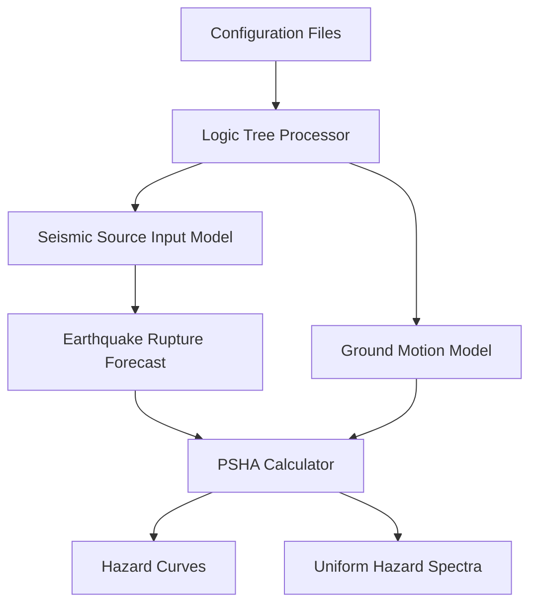

# Seismic_Hazard_Assessment_OpenQuake_ver-3.19

This repository contains the implementation of Probabilistic Seismic Hazard Analysis (PSHA) for a site in Uttarakhand, India (Seismic Zone V) using OpenQuake Engine v3.19. The main repository is found here: https://github.com/gem/oq-engine

## 📋 Overview

Seismic hazard assessment provides quantitative estimates of ground motion parameters at specific sites, forming the foundation for:
- Developing seismic design criteria
- Evaluating safety of existing structures
- Informing earthquake preparedness policies

## 🎯 Study Objectives

- Conduct PSHA for a representative site in Seismic Zone V (IS 1893:2016)
- Implement uncertainty quantification using logic tree framework
- Generate hazard curves and Uniform Hazard Spectra (UHS)

## 📚 Background

### Seismic Hazard Analysis Approaches

1. **Deterministic Seismic Hazard Analysis (DSHA)**
   - Considers worst-case scenario
   - Identifies largest credible earthquake
   - Provides conservative estimates
   - Does not account for uncertainties

2. **Probabilistic Seismic Hazard Analysis (PSHA)**
   - Developed by Cornell (1968)
   - Addresses aleatory and epistemic uncertainties
   - Quantifies hazard in terms of annual probabilities of exceedance

## 🛠️ Implementation

### OpenQuake Engine v3.19

The analysis utilizes OpenQuake Engine developed by the Global Earthquake Model Foundation (Pagani et al., 2014; Silva et al., 2014).

### Configuration Files

```
├── job.ini                 # Main configuration file
├── source_model/           # Seismic source files
│   ├── source_model_1.xml
│   ├── source_model_2.xml
│   └── source_model_3.xml
├── gmpe_logic_tree.xml     # Ground motion logic tree
└── source_logic_tree.xml   # Seismic source logic tree
```

### Workflow Architecture



## 📊 Methodology

### 1. Logic Tree Framework

#### Seismic Source Logic Tree
- **Three source models** based on Nath and Thingbaijam (2012)
  - Models 1-2: Smoothed seismicity (256 gridded point sources)
  - Model 3: Zone-based approach (256 area sources)
- **Nine Tectonic Region Types (TRTs)**:
  - Intraplate margin (lower/upper)
  - Active shallow crust (strike-slip/reverse, normal)
  - Subduction zones (intraslab, interface, interface megathrust)
  - Stable shallow crust

#### Ground Motion Logic Tree
- **GMPEs**: NGA-West2 models
  - Campbell & Bozorgnia (2014) - Weight: 0.5
  - Chiou & Youngs (2014) - Weight: 0.5
- **Period range**: 0.01s to 10s
- **Damping**: 5%

### 2. Source Characterization

Each seismic source includes:
- **Geometry**: Polygon/point coordinates
- **Depth range**: Upper and lower seismogenic depths
- **Magnitude-frequency**: Double truncated Gutenberg-Richter
- **Magnitude-scaling relationships**:
  - WC1994 (shallow crustal/intraplate)
  - Strasser et al. (2010) (subduction zones)
- **Focal mechanisms**: Strike, dip, rake distributions
- **Hypocentral depths**: Magnitude-independent distributions

### 3. Uncertainty Treatment

| Uncertainty Type | Addressed Through |
|-----------------|-------------------|
| Spatial | Multiple source models |
| Magnitude | Magnitude-frequency distributions |
| Intensity | Multiple GMPEs |
| Temporal | Poissonian model |

## 📈 Results

### Hazard Curves
- Annual probability of exceedance vs. ground motion intensity
- Generated for multiple spectral periods

### Uniform Hazard Spectra
Generated for probability of exceedance levels:
- 0.5% in 50 years (~10,000-year return period)
- 2% in 50 years (~2,475-year return period)
- 5% in 50 years (~975-year return period)
- 10% in 50 years (~475-year return period)
- 16% in 50 years (~285-year return period)
- 30% in 50 years (~140-year return period)

## 🚀 Usage

### Prerequisites
```bash
# Install OpenQuake Engine v3.19
pip install openquake-engine==3.19
```

### Running the Analysis
```bash
# Run PSHA calculation
oq engine --run job.ini

# Export results
oq export hcurves <calculation_id>
oq export uhs <calculation_id>
```

## 📁 Repository Structure

```
OpenQuake_Seismic_Hazard_Assessment/
├── README.md
├── configuration/
│   ├── job.ini (will be updated after paper acceptance)
│   ├── gmpe_logic_tree.xml
│   └── source_logic_tree.xml
├── source_models/
│   ├── source_model_1.xml
│   ├── source_model_2.xml
│   └── source_model_3.xml
├── results/
│   ├── hazard_curves/ (will be updated after paper acceptance)
│   └── uniform_hazard_spectra/ (will be updated after paper acceptance)
├── documentation/
│   └── methodology.pdf

```

## 📚 References

- Abrahamson, N., et al. (2014). Summary of the ASK14 ground motion relation for active crustal regions. *Earthquake Spectra*, 30(3), 1025-1055.
- Boore, D. M., et al. (2014). NGA-West2 equations for predicting PGA, PGV, and 5% damped PSA for shallow crustal earthquakes. *Earthquake Spectra*, 30(3), 1057-1085.
- Campbell, K. W., & Bozorgnia, Y. (2014). NGA-West2 ground motion model for the average horizontal components of PGA, PGV, and 5% damped linear acceleration response spectra. *Earthquake Spectra*, 30(3), 1087-1115.
- Chiou, B. S. J., & Youngs, R. R. (2014). Update of the Chiou and Youngs NGA model for the average horizontal component of peak ground motion and response spectra. *Earthquake Spectra*, 30(3), 1117-1153.
- Cornell, C. A. (1968). Engineering seismic risk analysis. *Bulletin of the Seismological Society of America*, 58(5), 1583-1606.
- Nath, S. K., & Thingbaijam, K. K. S. (2012). Probabilistic seismic hazard assessment of India. *Seismological Research Letters*, 83(1), 135-149.
- Pagani, M., et al. (2014). OpenQuake engine: An open hazard (and risk) software for the global earthquake model. *Seismological Research Letters*, 85(3), 692-702.
- Silva, V., et al. (2014). Development of the OpenQuake engine, the Global Earthquake Model's open-source software for seismic risk assessment. *Natural Hazards*, 72(3), 1409-1427.
- Strasser, F. O., et al. (2010). Scaling of the source dimensions of interface and intraslab subduction-zone earthquakes with moment magnitude. *Seismological Research Letters*, 81(6), 941-950.
- Wells, D. L., & Coppersmith, K. J. (1994). New empirical relationships among magnitude, rupture length, rupture width, rupture area, and surface displacement. *Bulletin of the Seismological Society of America*, 84(4), 974-1002.

## 📧 Contact

For questions or collaborations, please open an issue in this repository.

---
**Note**: Configuration files and detailed results are available in the respective directories, except for job.ini file. For complete methodology and theoretical background, refer to the documentation folder.
